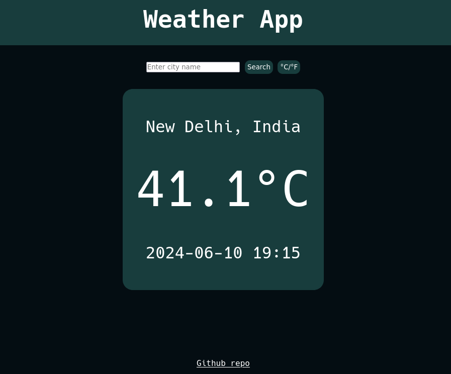

# Weather app
This is a simple weather app that uses weather api to find the temps at specific location.
I learned about async programming, fetch api, and promises 
I also learned that api requires keys to give access 

[Live Preview](https://anuragv668.github.io/weather-app/)

